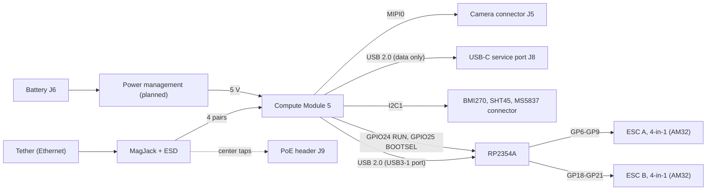

# Manafish Mainboard

The Manafish Mainboard is the main electronics board of the
[Manafish ROV](https://github.com/manafishrov). It replaces the Raspberry Pi 3B,
the USB-connected Raspberry Pi Pico and the wiring between them with one board:

- a **Raspberry Pi Compute Module 5** for the tether network, the camera and
  the vehicle firmware ([manafishrov/firmware](https://github.com/manafishrov/firmware)),
- an **RP2354A** microcontroller that drives the eight thrusters over
  bidirectional DShot ([manafishrov/mcu-firmware](https://github.com/manafishrov/mcu-firmware)),
- the camera connector, Ethernet with PoE-capable magnetics, and the on-board
  sensors.

> [!WARNING]
> Work in progress. The schematic is still being drawn, the PCB layout hasn't
> started, and no board has been built or tested. Don't manufacture from this
> repository yet.

## Overview
View the latest [KiCad Design](https://kicanvas.org/?repo=https%3A%2F%2Fgithub.com%2FTropaion%2FManafish_Mainboard%2Fblob%2Fmain%2Fhardware%2Fmanafish.kicad_pro)



## Schematic sheets

| Sheet | File | Contents | Origin |
| --- | --- | --- | --- |
| Manafish (top level) | `manafish.kicad_sch` | Sheet hierarchy, battery input J6, USB-C service port J8 | Original; USB-C port adapted from the CM5 IO Board |
| Raspberry Pi Compute Module 5 | `cm5.kicad_sch` | CM5 module connectors, boot and EEPROM jumper header J7 | Adapted from the CM5 IO Board |
| Camera Serial Interface | `csi.kicad_sch` | 22-pin MIPI camera connector J5 | Adapted from the CM5 IO Board |
| Ethernet | `ethernet.kicad_sch` | MagJack U3, ESD protection U1/U2, PoE center-tap header J9, link LEDs | Adapted from the CM5 IO Board |
| I2C Peripherals | `i2c_peripherals.kicad_sch` | BMI270 IMU, SHT45 humidity and temperature sensor, MS5837 connector, I2C pull-ups | Original |
| RP2354A | `rp2354a.kicad_sch` | RP2354A with core regulator, USB, SWD connector J2, ESC connectors J3/J4 | Original, following *Hardware design with RP2350* |
| Power Management | `power_management.kicad_sch` | Battery to 5 V (not drawn yet) | Original |

"Adapted from the CM5 IO Board" means the sheet started from Raspberry Pi's
reference design; see [Origin and attribution](#origin-and-attribution).

## Interfaces

Compute Module 5:

| Signal | CM5 pin | Connects to |
| --- | --- | --- |
| Ethernet pairs 0–3 | 3–12 | MagJack U3 |
| GPIO2 / GPIO3 (I2C1) | 58 / 56 | BMI270, SHT45, MS5837 connector |
| GPIO24 | 45 | RP2354A `RUN` |
| GPIO25 | 41 | RP2354A `QSPI_SS` (BOOTSEL) |
| USB3-1 D+ / D− (USB 2.0 pair) | 163 / 165 | RP2354A USB |
| MIPI0 data and clock lanes | 115–141 | Camera connector J5 |
| SDA0 / SCL0 | 82 / 80 | Camera connector J5 |
| CAM_GPIO0 / CAM_GPIO1 | 97 / 100 | Camera connector J5 |
| USB_P / USB_N (USB 2.0) | 105 / 103 | USB-C service port J8, data only |
| nRPIBOOT, EEPROM_nWP, SYNC_OUT, USB_OTG_ID, PMIC_ENABLE, PWR_BUT | 93, 20, 18, 101, 99, 92 | Jumper header J7 |
| GPIO_VREF | 78 | CM5_3.3V (3.3 V GPIO levels) |
| +5 V input | 77–87 | Power management |
| CM5_3.3V output | 84 / 86 | RP2354A and sensors |

RP2354A (QFN-60):

| Signal | RP2354A pin | Connects to |
| --- | --- | --- |
| GP6–GP9 | 9, 10, 12, 13 | ESC A connector J3 |
| GP18–GP21 | 29, 31, 32, 33 | ESC B connector J4 |
| USB_DP / USB_DM | 52 / 51 | CM5 USB3-1, 27 Ω in series |
| RUN | 26 | CM5 GPIO24 |
| QSPI_SS | 60 | CM5 GPIO25 |
| SWCLK / SWDIO | 24 / 25 | Debug connector J2 |
| XIN / XOUT | 21 / 22 | 12 MHz crystal Y1 (ABM8-272-T3) |

I2C devices on the CM5's I2C1 bus:

| Device | Address | Notes |
| --- | --- | --- |
| BMI270 IMU | `0x68` | `0x69` if SDO is pulled to VDDIO |
| SHT45-AD1F (with PTFE membrane) | `0x44` | |
| MS5837-30BA pressure sensor (external module) | `0x76` | Fixed address |

## Repository layout

```text
hardware/
├── manafish.kicad_pro      KiCad project
├── *.kicad_sch             schematic sheets
├── manafish.kicad_pcb      PCB (not started)
├── sym-lib-table           project symbol libraries
├── fp-lib-table            project footprint libraries
└── custom_components/
    ├── symbols/            CM5IO, BMI270, SHT45, ABM8-272-T3 symbols
    ├── footprints/         CM5IO, BMI270, SHT45, ABM8-272-T3, RP2350_Minimal footprints
    └── 3d/                 STEP models
```

## Flashing the Compute Module

The USB-C port J8 carries data only. Its VBUS isn't connected, so the board
needs its normal supply while you flash it.

1. Power the board.
2. Fit a jumper on J7 pins 1–2 (`nRPIBOOT`).
3. Connect J8 to a computer and run
   [`rpiboot`](https://github.com/raspberrypi/usbboot)
   `-d mass-storage-gadget64`. The eMMC appears as a USB drive.
4. Write the image, then remove the jumper.

Set `PSU_MAX_CURRENT=5000` in the bootloader EEPROM configuration. The CM5
isn't powered over USB-C, so it can't detect the supply's capability itself.

Jumper header J7:

| Pins | Signal | Fitted means |
| --- | --- | --- |
| 1–2 | `nRPIBOOT` | Boot from USB, for flashing |
| 3–4 | `EEPROM_nWP` | Bootloader EEPROM write-protected; blocks EEPROM updates |
| 5–6 | `SYNC_OUT` | Ethernet timing output; never fit a jumper |
| 9–10 | `USB_OTG_ID` | USB 2.0 port in host mode; leave open for flashing |
| 11–12 | `PMIC_ENABLE` | CM5 switched off |
| 13–14 | `PWR_BUT` | For a push button: short press shuts down or wakes, holding over 5 s forces power-off |

## Opening the project

1. Install [KiCad](https://www.kicad.org/) 10.0 or newer. The files are saved
   in the KiCad 10 format and won't open in older versions.
2. Open `hardware/manafish.kicad_pro`. The project libraries in
   `custom_components/` are registered in `sym-lib-table` and `fp-lib-table`;
   everything else comes from KiCad's standard libraries.

Datasheets aren't stored in the repository. Use the links below.

## Datasheets

- [Raspberry Pi Compute Module 5 datasheet](https://datasheets.raspberrypi.com/cm5/cm5-datasheet.pdf)
- [Compute Module 5 IO Board datasheet](https://datasheets.raspberrypi.com/cm5/cm5io-datasheet.pdf)
- [RP2350 datasheet](https://datasheets.raspberrypi.com/rp2350/rp2350-datasheet.pdf)
- [Hardware design with RP2350](https://datasheets.raspberrypi.com/rp2350/hardware-design-with-rp2350.pdf)
- [RP2350 product brief](https://datasheets.raspberrypi.com/rp2350/rp2350-product-brief.pdf)
- [Bosch BMI270 datasheet](https://www.bosch-sensortec.com/media/boschsensortec/downloads/datasheets/bst-bmi270-ds000.pdf)
- [Sensirion SHT45 product page and datasheet](https://sensirion.com/products/catalog/SHT45)

## Related repositories

- [manafishrov/firmware](https://github.com/manafishrov/firmware): vehicle
  firmware running on the Compute Module
- [manafishrov/mcu-firmware](https://github.com/manafishrov/mcu-firmware):
  thruster firmware running on the RP2354A (Pico 2 build)
- [manafishrov/esc-firmware](https://github.com/manafishrov/esc-firmware):
  AM32 firmware for the ESCs

## Origin and attribution

This board builds on the **Raspberry Pi Compute Module 5 IO Board (CM5IO)**
reference design by Raspberry Pi Ltd.

- **Source:** *CM5 IO Board, revision 2, KiCad files* (Raspberry Pi document
  RP-008099-DD-1), downloaded from the
  [Raspberry Pi Product Information Portal](https://pip.raspberrypi.com/categories/1098-design-files).
  The original files carry the notice "Copyright © 2024 Raspberry Pi Ltd."
- **Copied unchanged:** the symbol library
  `custom_components/symbols/CM5IO.kicad_sym`, all footprints in
  `custom_components/footprints/CM5IO.pretty/`, and eight 3D models in
  `custom_components/3d/`.
- **Adapted:** the circuits in `cm5.kicad_sch`, `csi.kicad_sch` and
  `ethernet.kicad_sch`, including the boot and EEPROM jumper header J7, and
  the USB-C service port J8 in `manafish.kicad_sch`.
- **Terms:** the CM5 IO Board datasheet says the design files "can be used in
  your own reference designs", and Raspberry Pi grants permission to use its
  resources "solely in conjunction with the Raspberry Pi products". These files
  and the parts derived from them remain © Raspberry Pi Ltd under those terms.
  They are **not** covered by this repository's license.

The RP2354A circuit follows Raspberry Pi's
[*Hardware design with RP2350*](https://datasheets.raspberrypi.com/rp2350/hardware-design-with-rp2350.pdf)
(RP-008280-DS). The footprints for the core regulator inductor L1 and the SWD
connector J2 come from Raspberry Pi's RP2350A minimal design, published under
the MIT license.

Raspberry Pi is a trademark of Raspberry Pi Ltd. This project is not affiliated
with or endorsed by Raspberry Pi Ltd.

[NOTICE.md](NOTICE.md) lists every third-party file and its terms.

## License

The original work in this repository is licensed under the GNU Affero General
Public License v3.0 or later; see [LICENSE](LICENSE). Third-party files keep
their own terms, listed in [NOTICE.md](NOTICE.md).
