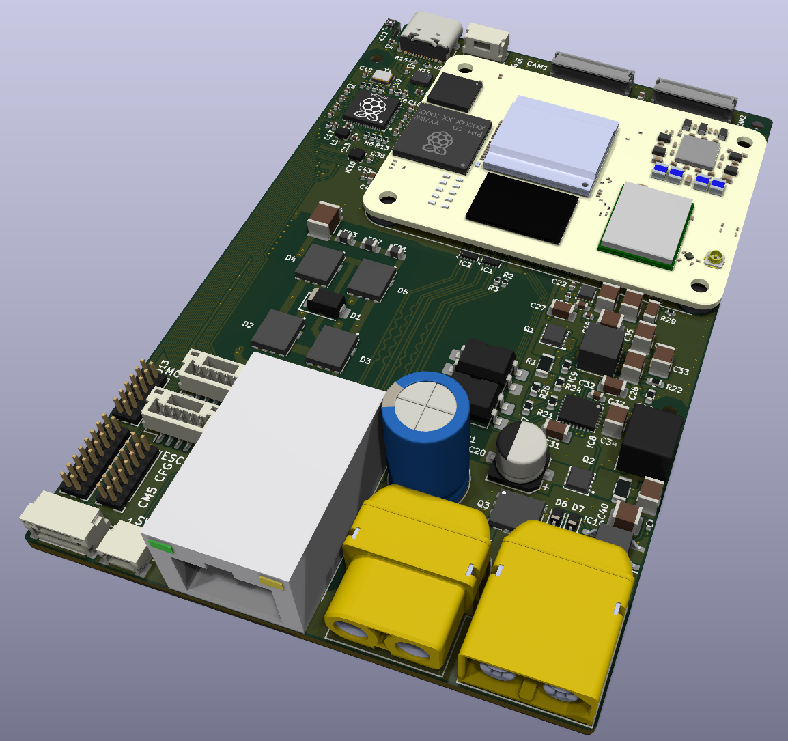
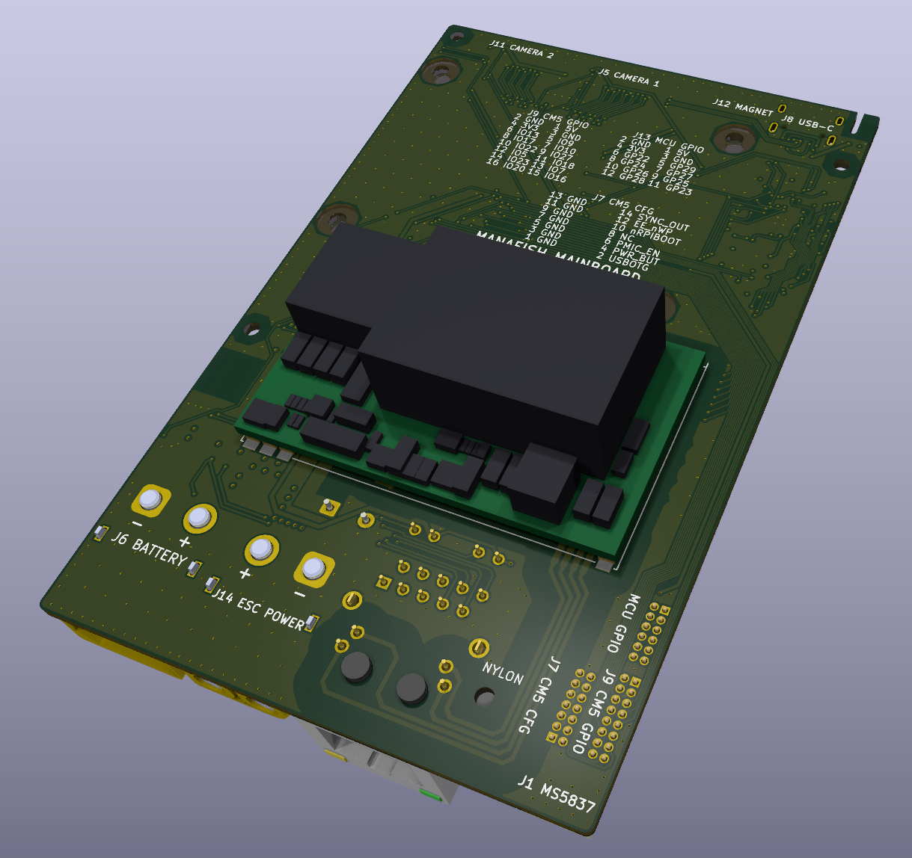
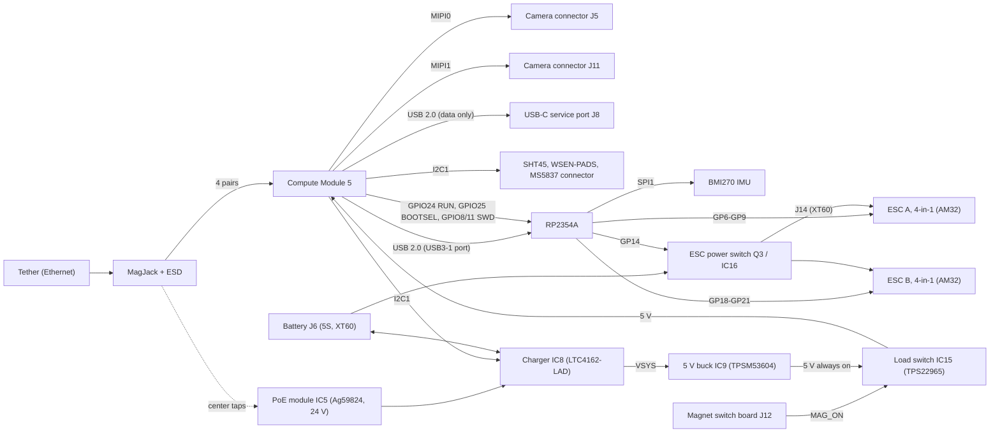

# Manafish Mainboard

The Manafish Mainboard is the main electronics board of the
[Manafish ROV](https://github.com/manafishrov). It replaces the Raspberry Pi 3B,
the USB-connected Raspberry Pi Pico and the wiring between them with one board:

- a **Raspberry Pi Compute Module 5** for the tether network, the camera and
  the vehicle software in [`software/`](software/) (upstream:
  [manafishrov/firmware](https://github.com/manafishrov/firmware)),
- an **RP2354A** microcontroller that drives the eight thrusters over
  bidirectional DShot, with the firmware in [`firmware/`](firmware/) (upstream:
  [manafishrov/mcu-firmware](https://github.com/manafishrov/mcu-firmware)),
- two camera connectors, Ethernet with PoE-capable magnetics, a magnet power
  switch input, and the on-board sensors.

> [!WARNING]
> Work in progress. The schematic and the 4-layer PCB layout are drawn, but no
> board has been built or tested. Don't manufacture from this repository yet.
> `firmware/` builds the mainboard MCU target and `software/` the CM5 image,
> but neither has run on this board yet; the ports are in progress.

</img> </img>

## Overview
View the latest [PCB Interactive BOM](https://htmlpreview.github.io/?https://github.com/Tropaion/Manafish_Mainboard/blob/main/hardware/mainboard/bom/ibom.html) or [KiCad Design](https://kicanvas.org/?repo=https%3A%2F%2Fgithub.com%2FTropaion%2FManafish_Mainboard%2Fblob%2Fmain%2Fhardware%2Fmainboard%2Fmanafish.kicad_pro).


```mermaid
flowchart LR
  tether["Tether (Ethernet)"] --> magjack["MagJack + ESD"]
  magjack -->|4 pairs| cm5["Compute Module 5"]
  magjack -.->|center taps| poe["PoE module IC5 (Ag59824, 24 V)"]
  cm5 -->|MIPI0| cam["Camera connector J5"]
  cm5 -->|MIPI1| cam2["Camera connector J11"]
  cm5 -->|"USB 2.0 (data only)"| service["USB-C service port J8"]
  cm5 -->|I2C1| sensors["SHT45, WSEN-PADS, MS5837 connector"]
  cm5 -->|"USB 2.0 (USB3-1 port)"| mcu["RP2354A"]
  cm5 -->|"GPIO24 RUN, GPIO25 BOOTSEL, GPIO8/11 SWD"| mcu
  mcu -->|SPI1| imu["BMI270 IMU"]
  mcu -->|GP6-GP9| escA["ESC A, 4-in-1 (AM32)"]
  mcu -->|GP18-GP21| escB["ESC B, 4-in-1 (AM32)"]
  poe --> chg["Charger IC8 (LTC4162-LAD)"]
  cm5 -->|I2C1| chg
  bat["Battery J6 (5S, XT60)"] <--> chg
  bat --> escsw["ESC power switch Q3 / IC16"]
  mcu -->|GP14| escsw
  escsw -->|"J14 (XT60)"| escA
  escsw --> escB
  chg -->|VSYS| buck["5 V buck IC9 (TPSM53604)"]
  mag["Magnet switch board J12"] -->|MAG_ON| lsw
  buck -->|5 V always on| lsw["Load switch IC15 (TPS22965)"]
  lsw -->|5 V| cm5
```

## Schematic sheets

| Sheet | File | Contents | Origin |
| --- | --- | --- | --- |
| Manafish (top level) | `manafish.kicad_sch` | Sheet hierarchy, battery input J6 (XT60), switched ESC power output J14 (XT60, switch Q3/IC16), USB-C service port J8, magnet switch connector J12 | Original; USB-C port adapted from the CM5 IO Board |
| Raspberry Pi Compute Module 5 | `cm5.kicad_sch` | CM5 module connectors, boot and EEPROM jumper header J7, breakout header J9 | Adapted from the CM5 IO Board |
| Camera Serial Interface | `csi.kicad_sch` | 22-pin MIPI camera connectors J5 (MIPI0) and J11 (MIPI1), vertical Molex 501951-2230, 3.3 V from CM5_3.3V with 10 µF at each connector | Adapted from the CM5 IO Board |
| Ethernet | `ethernet.kicad_sch` | MagJack IC3 (YAGEO JXF0-1012NL, 4-pair PoE center taps), ESD protection IC1/IC2, MagJack LEDs (green = activity from CM5 `nLED3`, yellow = link speed from `nLED2`) | Adapted from the CM5 IO Board |
| Serial Peripherals | `serial_peripherals.kicad_sch` | BMI270 IMU IC11 (SPI to the RP2354A), SHT45 humidity and temperature sensor IC12, WSEN-PADS pressure sensor IC10, MS5837 connector J1 | Original |
| RP2354A | `rp2354a.kicad_sch` | RP2354A with core regulator, 12 MHz crystal Y1, USB, SWD connector J2, ESC connectors J3/J4, breakout header J13 | Original, following *Hardware design with RP2350* |
| Power Management | `power_management.kicad_sch` | PoE bridges D2–D5, TVS D1, PoE module IC5, PoE type optocouplers IC6/IC7, LTC4162-LAD charger IC8 with FETs Q1/Q2 (R1 8 mΩ: 4.0 A input limit; R20 10 mΩ: 3.2 A charge maximum), 5 V buck IC9, load switch IC15 | Original |

"Adapted from the CM5 IO Board" means the sheet started from Raspberry Pi's
reference design; see [Origin and attribution](#origin-and-attribution).

## Interfaces

Compute Module 5:

| Signal | CM5 pin | Connects to |
| --- | --- | --- |
| Ethernet pairs 0–3 | 3–12 | MagJack IC3 |
| GPIO2 / GPIO3 (I2C1) | 58 / 56 | SHT45 IC12, WSEN-PADS IC10, LTC4162 IC8, MS5837 connector J1 |
| GPIO24 | 45 | RP2354A `RUN` through 330 Ω R9 (4.7 kΩ pull-up R11) |
| GPIO25 | 41 | RP2354A `QSPI_SS` (BOOTSEL) through 1 kΩ R12 (10 kΩ pull-up R13) |
| GPIO11 / GPIO8 | 38 / 39 | RP2354A `SWCLK` / `SWDIO` through 33 Ω R16/R17 (shared with J2) |
| GPIO6 / GPIO12 | 30 / 31 | PoE type detect TYP2 / TYP3 through optocouplers IC6/IC7 (active low; enable the CM5 pull-ups) |
| GPIO4, 5, 7, 9, 10, 13, 16–23, 26, 27 | 24–29, 34, 37, 40, 44, 46–50, 54 | Breakout header J9 |
| USB3-1 D+ / D− (USB 2.0 pair) | 163 / 165 | RP2354A USB |
| MIPI0 data and clock lanes | 115–141 | Camera connector J5 |
| SDA0 / SCL0 | 82 / 80 | Camera connector J5 |
| CAM_GPIO0 / CAM_GPIO1 | 97 / 100 | Camera connector J5 |
| MIPI1 data and clock lanes | 175–196 | Camera connector J11 |
| ID_SD / ID_SC (I2C, 2.2 kΩ pull-ups R4/R5) | 36 / 35 | Camera connector J11 |
| GPIO14 / GPIO15 | 55 / 51 | Camera connector J11 pins 17 / 18 (CAM1_GPIO0 / CAM1_GPIO1) |
| USB_P / USB_N (USB 2.0) | 105 / 103 | USB-C service port J8, data only |
| nRPIBOOT, EEPROM_nWP, SYNC_OUT, USB_OTG_ID, PMIC_ENABLE, PWR_BUT | 93, 20, 18, 101, 99, 92 | Jumper header J7 |
| GPIO_VREF | 78 | CM5_3.3V (3.3 V GPIO levels) |
| +5 V input | 77–87 | Power management, through load switch IC15 |
| CM5_3.3V output | 84 / 86 | RP2354A and sensors |

RP2354A (QFN-60):

| Signal | RP2354A pin | Connects to |
| --- | --- | --- |
| GP6–GP9 | 9, 10, 12, 13 | ESC A connector J3 |
| GP18–GP21 | 29, 31, 32, 33 | ESC B connector J4 |
| GP10–GP13 (SPI1) | 14, 15, 16, 17 | BMI270 IMU IC11: SCK, MOSI (SDX), MISO (SDO), CS; INT1/INT2 not connected |
| GP14 | 18 | ESC power switch: high = battery on ESC power connector J14 |
| GP22–GP29 | 34–37, 40–43 | Breakout header J13 |
| USB_DP / USB_DM | 52 / 51 | CM5 USB3-1, 27 Ω in series |
| RUN | 26 | CM5 GPIO24 through 330 Ω R9, 4.7 kΩ pull-up R11 |
| QSPI_SS | 60 | CM5 GPIO25 through 1 kΩ R12, 10 kΩ pull-up R13 |
| SWCLK / SWDIO | 24 / 25 | Debug connector J2, and CM5 GPIO11 / GPIO8 through 33 Ω R16/R17 |
| XIN / XOUT | 21 / 22 | 12 MHz crystal Y1 (TX322512M4DBDE2T, on the ABM8-272-T3 footprint) |

RUN and BOOTSEL are active low and driven straight from the CM5 GPIOs, without
transistors. Drive GPIO24 low to reset the RP2354A; hold GPIO25 low while RUN
goes high to start its USB bootloader. Otherwise leave both pins as inputs: the
pull-ups hold them high.

The ESC power switch connects the battery to J14 (both ESCs) through MOSFET Q3, driven by the
photovoltaic MOSFET driver IC16 from GP14. It is a static switch: switch it only with the motors
stopped, and it has no current limit (the battery BMS protects). A soft start ramps the ESC supply
in about 1.5 s, up to about 12 s worst case. So the firmware must:

- arm the ESCs or allow thrust only 15 s or more after switching on;
- keep GP14 low for at least 5 s after boot, after the battery is plugged in, and after any off;
- never switch ESC power back on automatically at boot;
- drive GP14 at 12 mA.

The camera connectors are vertical, so the cable plugs in from above. Their footprint numbers the pads
in reverse (pad n = Molex circuit 23 − n), the same way Raspberry Pi numbers the Hirose connector on
the CM5 IO Board, so a standard Pi 22-pin cable lands pin 1 (GND) on pin 1.

Breakout headers (1.27 mm pitch; J9 is 2 × 10, J13 is 2 × 6). The pin tables
are also on the bottom silkscreen, under wrong headings (see
[Next revision notes](#next-revision-notes)):

| Pin | J9, CM5 GPIO | J13, RP2354A GPIO |
| --- | --- | --- |
| 1 / 2 | +5 V / +3.3 V | +5 V / +3.3 V |
| 3 / 4 | GND / GND | GND / GND |
| 5 / 6 | GPIO26 / GPIO21 | GP29 / GP22 |
| 7 / 8 | GPIO19 / GPIO20 | GP27 / GP24 |
| 9 / 10 | GPIO13 / GPIO16 | GP25 / GP26 |
| 11 / 12 | GPIO5 / GPIO7 | GP23 / GP28 |
| 13 / 14 | GPIO9 / GPIO10 | |
| 15 / 16 | GPIO22 / GPIO23 | |
| 17 / 18 | GPIO27 / GPIO18 | |
| 19 / 20 | GPIO17 / GPIO4 | |

+5 V is the switched 5 V after IC15, +3.3 V is CM5_3.3V. GP26–GP29 on J13 are
the RP2354A's ADC inputs.

I2C devices on the CM5's I2C1 bus (GPIO2/GPIO3). The board has no pull-ups; the
CM5 has 1.8 kΩ on both lines:

| Device | Address | Notes |
| --- | --- | --- |
| SHT45-AD1F humidity and temperature sensor IC12 (with membrane) | `0x44` | |
| WSEN-PADS pressure sensor IC10 | `0x5C` | SA0 tied to GND; CS tied high selects I2C |
| LTC4162-LAD charger IC8 | `0x68` | Fixed address; `SMBALERT` isn't connected, so poll |
| MS5837-30BA pressure sensor (external module, connector J1) | `0x76` | Fixed address |

The BMI270 IMU IC11 isn't on this bus. It sits on the RP2354A's SPI1
(GP10–GP13).

## Repository layout

```text
CLAUDE.md                       rules for coding agents: commits, quality gates, tags, upstream sync
.github/workflows/              CI: firmware-ci.yml, software-ci.yml, software-image.yml
.pre-commit-config.yaml         pre-commit hooks for firmware/ and software/
docs/wiki/                      arc42 architecture docs, source of the Gitea wiki
hardware/
├── mainboard/
│   ├── manafish.kicad_pro      KiCad project
│   ├── *.kicad_sch             schematic sheets (i2c_peripherals.kicad_sch is an old copy, not in the hierarchy)
│   ├── manafish.kicad_pcb      PCB, 4 layers
│   ├── manafish.kicad_dru      custom DRC rules (PoE isolation barriers, impedance pairs, edge parts)
│   ├── manafish.csv            BOM exported from KiCad
│   ├── sym-lib-table           project symbol libraries
│   ├── fp-lib-table            project footprint libraries
│   ├── custom_components/
│   │   ├── symbols/            CM5IO, BMI270, SHT45-AD1F-R2, ABM8-272-T3, Silvertel, V6K100DUHM3_H, FDMC8327L,
│   │   │                       NTMFS5C404NL, LTC4162, TPS22965, VOM1271T, YAGEO symbols
│   │   ├── footprints/         CM5IO, BMI270, SHT45, ABM8-272-T3, RP2350_Minimal, Silvertel, V6K100DUHM3,
│   │   │                       FDMC86139P, LTC4162, Molex, Vishay, YAGEO footprints
│   │   └── 3d/                 STEP models
│   ├── production/             JLCPCB Gerbers, BOM and CPL, and jlc_export.py that writes them
│   ├── simulation/             ngspice simulations of the ESC switch soft start
│   └── bom/                    interactive HTML BOM
└── magnetic_switch/            magnet switch PCB (2 layers, hand-soldered): BOM in Magnetic Switch.csv and bom/ibom.html,
                                JLCPCB Gerbers in production/
firmware/                       RP2354A firmware (C11, Pico SDK 2.3.1), adapted from manafishrov/mcu-firmware
software/                       CM5 software: Python package rov_firmware and the NixOS SD image,
                                adapted from manafishrov/firmware
images/                         board pictures for this README
```

[`firmware/`](firmware/) and [`software/`](software/) each have their own
README, LICENSE and Nix flake. The architecture docs start at
[docs/wiki/Home.md](docs/wiki/Home.md).

## PCB

`manafish.kicad_pcb` is a 70 × 109.2 mm, 4-layer board (revision 3). It sits
centred on the axis of a tube with a 74 mm inner diameter, so a part at lateral
distance *d* from the axis may stand at most √(37² − *d*²) − 0.8 mm above the
board surface. Every part fits with this conservative rule; the board note
gives a 74.5 mm tube, which adds margin. The tightest are the CM5 stack at the
right edge (1.2 mm margin) and the battery connector J6 (2.6 mm). The tall
parts sit near the centre line: the MagJack IC3 7.7 mm and the bulk capacitor
C20 6.4 mm off it.

Placement:

- **Top edge:** the SHT45 (IC12) on a slotted tongue in the top-left corner,
  the USB-C service port J8, the magnet switch connector J12 and the two camera
  connectors J5 and J11 side by side.
- **Top half:** the CM5, with connector B towards the cameras and USB and
  connector A towards the PoE module. The RP2354A with its regulator, crystal,
  IMU and pressure sensor IC10 fills the strip left of the CM5.
- **Below the CM5:** the PoE module IC5 on the bottom side. The PoE input
  parts (bridges, ferrites, Y-capacitors) sit on the top over its input half.
  The power section (load switch IC15, 5 V buck IC9, charger IC8 with its
  inductor L2 at the right edge) is grouped over its output half.
- **Bottom edge:** the MagJack IC3 towards the centre, the XT60 connectors J14
  (ESC power) and J6 (battery) with the ESC switch Q3, and C20. The breakout
  headers J7, J9 and J13, the vertical ESC connectors J3/J4, the SWD
  connector J2 and the MS5837 connector J1 sit left of the MagJack.

All connectors are on the top side. Every part except IC5 is on the top.

The SHT45's tongue has no copper pour and no vias; only four thin tracks cross
its bridge. Its bypass capacitor C4 sits just outside the tongue. Four M2
mounting holes are at H1–H4. H3 lies inside the PoE input lines: use a nylon
screw and a nylon standoff there.

The planes under the charger inductor L2 are cut out on all layers, and nothing
sits under it on the other side.

### Stackup

JLCPCB JLC04161H-7628, 1.6 mm, ENIG finish:

| Layer | Thickness | Use |
| --- | --- | --- |
| F.Cu | 35 µm | Parts, signals, GND and power pours |
| Prepreg 7628 | 0.21 mm, εr 4.4 | |
| In1.Cu | 15 µm | Solid GND reference, no tracks |
| Core | 1.065 mm, εr 4.6 | |
| In2.Cu | 15 µm | GND, power pours (VSYS, MCU 3.3 V, 5 V, battery, ESC power), signals; solid GND under the B.Cu pairs |
| Prepreg 7628 | 0.21 mm, εr 4.4 | |
| B.Cu | 35 µm | PoE module IC5, PoE input lines, signals, GND and 24 V pours |

Order the board with impedance control:

| Net class | Nets | Width / gap | Target |
| --- | --- | --- | --- |
| `DP100` | Ethernet `TRD*`, camera `DPHY0_*` and `DPHY1_*` | 0.21 / 0.19 mm on F.Cu and B.Cu | 100 Ω differential |
| `USB90` | `USB2_*`, RP2354A `USB_D*` | 0.24 / 0.15 mm on F.Cu and B.Cu | 90 Ω differential |

Inside the CM5 and camera connector pin fields the pairs neck down to
0.127 mm. Pours keep 0.3 mm from the pairs everywhere.

The default clearance is 0.1 mm (JLCPCB's minimum is 0.09 mm). Power nets and
the impedance pairs keep 0.2 mm. All traces use 45° bends.

### PoE isolation

The PoE input side (the `Primary` net class: center taps, bridges, IC5 input,
TYP outputs) is isolated from the rest of the board. `manafish.kicad_dru`
enforces:

- 2.0 mm from primary copper to any other net, on every layer and from every
  hole. The only exception is between the pads of each Y-capacitor
  (C21, C24). Four violations are still open; see [DRC results](#drc-results).
- A 3.0 mm warning tier, the Silvertel guideline. 43 warnings remain. Ten are
  below 2.0 mm, the same spots as the DRC errors below. Most of the others are
  inherent to the footprints (the MagJack's center-tap pins next to its shield
  pins, 2.14 mm; J7's pins next to the VC1 and VC4 lines) or to the
  Y-capacitors' own connections. The rest are the RP2354A SWD lines and a VIN+
  via near the PoE input (closest 2.68 mm).
- Under IC5's primary half (`PRI_ISLAND_U5`), no vias of other nets and no
  other copper on B.Cu or In2. The module's isolation barrier strip stays
  empty on B.Cu and In2.

In1 and In2 are voided 2 mm around primary copper. Where the four Ethernet
pairs cross the PoE input lines, this leaves them without a reference plane
for about 5.4 mm. Only IC5, the optocouplers IC6/IC7 and the Y-capacitors
C21/C24 cross the barrier.

### Assembly

- Every part except IC5 is on the top. Reflow the top side only.
- Solder IC5 (Ag59824-LPB, bottom side) by hand (iron or hot air). It must never
  pass through reflow hanging upside down.
  - Hot-air profile: peak 230–245 °C, 30–90 s above 217 °C, soak 150–180 °C for
    30–90 s, ramp up at most 3 °C/s and down at most 6 °C/s.
  - No wave solder on the IC5 side.
- Solder the through-hole parts IC3, J6, J14, J7, J9, J13, C20 and the four
  shell tabs of the USB-C port J8 by hand.
- The exposed-pad vias of IC4, IC8, IC9 and IC15 are open on the top through
  their pads and tented on the bottom. IC4's four vias sit in the gaps of its
  3 × 3 paste grid, so the paste doesn't flow into them.
- The SHT45 and the other symmetric parts have their pin 1 at the silkscreen dot.
- Fit the CM5 with M2.5 screws from below (head at most 4.5 mm across) and the
  nuts on the CM5 side. The board itself mounts with four M2 screws (H1–H4);
  H3 needs nylon hardware.

The same notes are on the board's User.Comments layer, which isn't part of the
Gerbers: copy them into the order remarks for the assembler.

### DRC results

KiCad's DRC shows 7 errors, still open:

- 4 PoE clearance errors below the 2.0 mm rule: the VC1 line on B.Cu passes
  J7's GND pin 1 at 1.59 mm and 1.95 mm, and the VC3 line passes the MagJack
  IC3's shield pin 19 at 1.93 mm (two segments). With "Report all errors for
  each track" these two spots give 17 items, because the VC1 line runs along
  all of J7's odd (GND) pins.
- 3 starved thermals: J9 pin 2 (3.3 V) on the In2 pour, and pad 1 of C23 and
  C41 on the F.Cu 5 V pour, each with one of two spokes.

The warnings are the 43 PoE advisories above, 13 footprints whose silkscreen or
mask the layout changed on the board (marks moved off pads or the board edge,
IC9's vias tented), and 27 silkscreen items (12 silk over copper, 15 silk
overlap, mostly reference designators around IC15, C41 and C47). Updating
footprints from the library would undo those changes. The 11 "PTH inside
courtyard" items (IC9's thermal vias above IC5, on the other side) are excluded
with a comment.

### Testing the isolation

Use the 1500 V 10/700 µs impulse test only, at normal air pressure. Don't run
a 1500 Vrms or 2250 Vdc hipot: the Ag59824 is rated only for the impulse
test, and 2250 V exceeds the Y-capacitors' 2 kV rating. Afterwards the primary
side must measure at least 2 MΩ to GND at 500 Vdc.

### Next revision notes

Known issues in this design (layout revision 3, silkscreen v1.0), to fix in the
next board revision:

- The bottom-silkscreen pin tables are headed `J10 MCU GPIO`, `J5 CM5 CFG` and
  `J6 CM5 GPIO`. They belong to J13, J7 and J9 (J5 is camera 1, J6 the
  battery). The pin lists under the headings are correct.
- The cable connectors have no ESD protection: J1 (MS5837, I2C1 and 3.3 V),
  J3/J4 (ESC signals, straight to RP2354A GP6–GP9 and GP18–GP21 without series
  resistors), J8 (USB-C data, straight to the CM5) and J12 (magnet switch).
  Only the Ethernet pairs have it (IC1/IC2).
- On the magnet switch board the unused half of the CD4013 U1 floats: inputs
  S, D, R and CLK (pins 8, 9, 10 and 11) are marked no-connect. CMOS inputs
  must not float; tie them to GND.
- The CM5 can't read the charger's `SMBALERT` (IC8 pin 12, not connected), the
  5 V buck's `PGOOD` (IC9 pin 6, only pulled up by R23 to IC9's own V5V pin) or
  `MAG_ON` (J12 pin 2, only drives IC15's ON pin). Software must poll the
  LTC4162 alert registers over I2C, and it gets no warning before the magnet
  switch cuts the 5 V supply.
- The charger has no battery thermistor. R26 and R27 (10 kΩ each) hold its NTC
  input at the 25 °C point, and J6 (XT60) has no NTC pin, so charging isn't
  temperature-qualified.
- The net names `ETH_LEDG` and `ETH_LEDY` are swapped. `ETH_LEDG` (CM5
  `nLED2`, speed) drives the MagJack's yellow LED, `ETH_LEDY` (`nLED3`,
  activity) the green one. The colours match the CM5 datasheet; only the names
  are wrong.
- The VC1 line on B.Cu passes J7's GND pins at 1.59 mm and the VC3 line passes
  the MagJack's shield pin 19 at 1.93 mm, below the 2.0 mm PoE isolation rule.
  Move both lines. J9 pin 2, C23 and C41 connect to their pours with one
  thermal spoke. J9 pin 2 changed from GND to 3.3 V, so the one-spoke DRC
  exception for GND header pins no longer covers it.

## Flashing the Compute Module

The USB-C port J8 carries data only. Its VBUS isn't connected, so the board
needs its normal supply while you flash it.

1. Power the board.
2. Fit a jumper on J7 pins 9–10 (`nRPIBOOT`).
3. Connect J8 to a computer and run
   [`rpiboot`](https://github.com/raspberrypi/usbboot)
   `-d mass-storage-gadget64`. The eMMC appears as a USB drive.
4. Write the image, then remove the jumper.

Set `PSU_MAX_CURRENT=5000` in the bootloader EEPROM configuration. The CM5
isn't powered over USB-C, so it can't detect the supply's capability itself.

Jumper header J7 (odd pins are GND):

| Pins | Signal | Fitted means |
| --- | --- | --- |
| 1–2 | `USB_OTG_ID` | USB 2.0 port in host mode; leave open for flashing |
| 3–4 | `PWR_BUT` | For a push button: short press shuts down or wakes, holding over 5 s forces power-off |
| 5–6 | `PMIC_ENABLE` | CM5 switched off |
| 7–8 | Not connected | |
| 9–10 | `nRPIBOOT` | Boot from USB, for flashing |
| 11–12 | `EEPROM_nWP` | Bootloader EEPROM write-protected; blocks EEPROM updates |
| 13–14 | `SYNC_OUT` | Ethernet timing output; never fit a jumper |

## Opening the project

1. Install [KiCad](https://www.kicad.org/) 10.0 or newer. The files are saved
   in the KiCad 10 format and won't open in older versions.
2. Open `hardware/mainboard/manafish.kicad_pro`. The project libraries in
   `custom_components/` are registered in `sym-lib-table` and `fp-lib-table`;
   everything else comes from KiCad's standard libraries.

Datasheets aren't stored in the repository. Use the links below.

## Datasheets

- [Raspberry Pi Compute Module 5 datasheet](https://datasheets.raspberrypi.com/cm5/cm5-datasheet.pdf)
- [Compute Module 5 IO Board datasheet](https://datasheets.raspberrypi.com/cm5/cm5io-datasheet.pdf)
- [RP2350 datasheet](https://datasheets.raspberrypi.com/rp2350/rp2350-datasheet.pdf)
- [Hardware design with RP2350](https://datasheets.raspberrypi.com/rp2350/hardware-design-with-rp2350.pdf)
- [RP2350 product brief](https://datasheets.raspberrypi.com/rp2350/rp2350-product-brief.pdf)
- [Bosch BMI270 datasheet](https://www.bosch-sensortec.com/media/boschsensortec/downloads/datasheets/bst-bmi270-ds000.pdf)
- [Sensirion SHT45 product page and datasheet](https://sensirion.com/products/catalog/SHT45)
- [Silvertel Ag59800 (Ag59824-LPB) PoE++ module datasheet](https://silvertel.com/images/datasheets/Ag59800-LPB%20-datasheet-high%20efficiency%20SMT%20IEEE802_3BT%20100W%20power-over-ethernet%20module.pdf)
- [Vishay V6K100DU dual Schottky diode datasheet](https://www.vishay.com/docs/87418/v6k100du.pdf)
- [Analog Devices LTC4162-L battery charger datasheet](https://www.analog.com/media/en/technical-documentation/data-sheets/LTC4162-L.pdf) (covers the LTC4162-LAD)
- [YAGEO (Pulse) JXF0-xx12NL MagJack datasheet J520](https://www.yageogroup.com/content/datasheet/asset/file/DATASHEET_J520)
- [Würth Elektronik WSEN-PADS 2511020213301 user manual](https://www.we-online.com/components/products/manual/Manual-um-wsen-pads-2511020213301%20%28rev3.1%29.pdf)
- [TI TPSM53604 buck module datasheet](https://www.ti.com/lit/ds/symlink/tpsm53604.pdf)
- [TI TPS22965 load switch datasheet](https://www.ti.com/lit/ds/symlink/tps22965.pdf)
- [Vishay VOM1271 photovoltaic MOSFET driver datasheet](https://www.vishay.com/docs/83469/vom1271.pdf)
- [TI CD4013B flip-flop datasheet](https://www.ti.com/lit/ds/symlink/cd4013b.pdf) (magnet switch board)

## Related repositories

The code for the two processors lives in this repository. Both folders are
adapted copies of Manafish upstreams and are kept in sync with `git subtree`
(see [CLAUDE.md](CLAUDE.md)):

- [`software/`](software/): vehicle software running on the Compute Module
  (Python service and NixOS image). Upstream:
  [manafishrov/firmware](https://github.com/manafishrov/firmware).
- [`firmware/`](firmware/): thruster firmware running on the RP2354A. Upstream:
  [manafishrov/mcu-firmware](https://github.com/manafishrov/mcu-firmware)
  (Pico and Pico 2 builds).
- [manafishrov/esc-firmware](https://github.com/manafishrov/esc-firmware):
  AM32 firmware for the ESCs. The software image bundles one of its release
  binaries.

## Origin and attribution

This board builds on the **Raspberry Pi Compute Module 5 IO Board (CM5IO)**
reference design by Raspberry Pi Ltd.

- **Source:** *CM5 IO Board, revision 2, KiCad files* (Raspberry Pi document
  RP-008099-DD-1), downloaded from the
  [Raspberry Pi Product Information Portal](https://pip.raspberrypi.com/categories/1098-design-files).
  The original files carry the notice "Copyright © 2024 Raspberry Pi Ltd."
- **Copied unchanged:** the symbol library
  `custom_components/symbols/CM5IO.kicad_sym`, all footprints in
  `custom_components/footprints/CM5IO.pretty/`, and eight 3D models in
  `custom_components/3d/`.
- **Adapted:** the circuits in `cm5.kicad_sch`, `csi.kicad_sch` and
  `ethernet.kicad_sch`, including the boot and EEPROM jumper header J7, and
  the USB-C service port J8 in `manafish.kicad_sch`.
- **Terms:** the CM5 IO Board datasheet says the design files "can be used in
  your own reference designs", and Raspberry Pi grants permission to use its
  resources "solely in conjunction with the Raspberry Pi products". These files
  and the parts derived from them remain © Raspberry Pi Ltd under those terms.
  They are **not** covered by this repository's license.

The RP2354A circuit follows Raspberry Pi's
[*Hardware design with RP2350*](https://datasheets.raspberrypi.com/rp2350/hardware-design-with-rp2350.pdf)
(RP-008280-DS). The footprints for the core regulator inductor L1 and the SWD
connector J2 come from Raspberry Pi's RP2350A minimal design, published under
the MIT license.

Raspberry Pi is a trademark of Raspberry Pi Ltd. This project is not affiliated
with or endorsed by Raspberry Pi Ltd.

[NOTICE.md](NOTICE.md) lists every third-party file and its terms.

## License

The original work in this repository is licensed under the GNU Affero General
Public License v3.0 or later; see [LICENSE](LICENSE). Third-party files keep
their own terms, listed in [NOTICE.md](NOTICE.md).

[`firmware/`](firmware/) and [`software/`](software/) are adapted copies of
[manafishrov/mcu-firmware](https://github.com/manafishrov/mcu-firmware) and
[manafishrov/firmware](https://github.com/manafishrov/firmware). Both upstreams
are licensed under AGPL-3.0-or-later, and each folder keeps its own copy of the
license: [firmware/LICENSE](firmware/LICENSE) and
[software/LICENSE](software/LICENSE). Changes made here are under the same
license.
